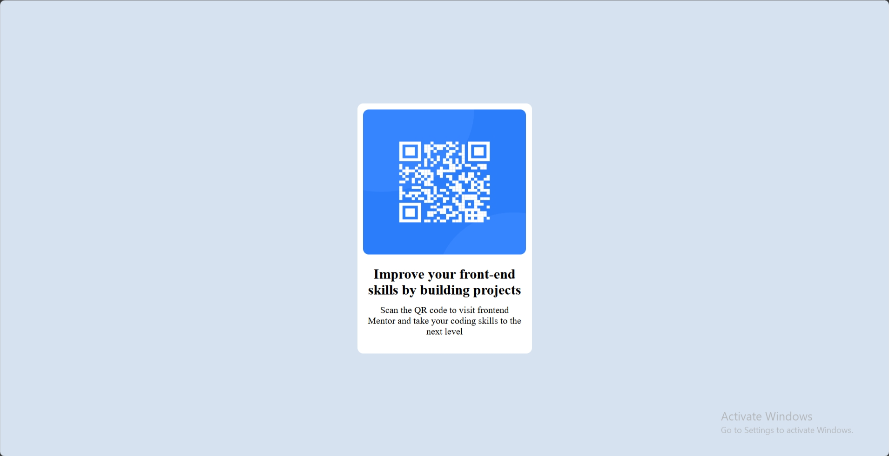
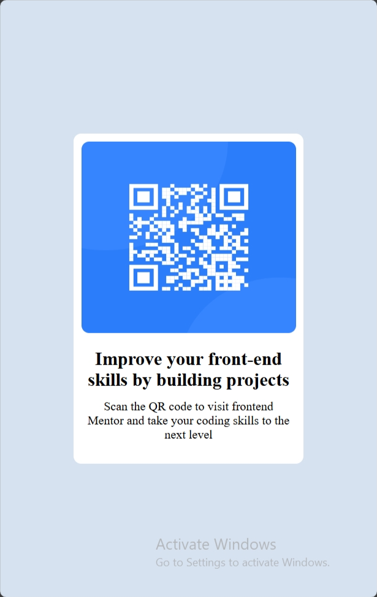

# Frontend Mentor - QR code component solution

This is a solution to the [QR code component challenge on Frontend Mentor](https://www.frontendmentor.io/challenges/qr-code-component-iux_sIO_H). Frontend Mentor challenges help you improve your coding skills by building realistic projects.

## Table of contents

- [Overview](#overview)
  - [Screenshot](#screenshot)
  - [Links](#links)
- [My process](#my-process)
  - [Built with](#built-with)
  - [What I learned](#what-i-learned)
  - [Continued development](#continued-development)

## Overview

### Screenshot

 ](./screenshot.jpg)

### Links

- Solution URL: [Add solution URL here](https://your-solution-url.com)
- Live Site URL: [Add live site URL here](https://your-live-site-url.com)

## My process

### Built with

- Semantic HTML5 markup
- CSS custom properties
- Flexbox
- CSS Grid
- Mobile-first workflow

### What I learned

Working on this project allowed me to improve my understanding of using Flexbox to center elements and create responsive layouts. For example, I used Flexbox in the section and main containers to center the QR code component in the viewport:

To see how you can add code snippets, see below:

```css
section {
  background-color: hsl(212, 45%, 89%);
  height: 100vh;
  display: flex;
  justify-content: center;
  align-items: center;
}

.main {
  padding: 10px;
  background-color: hsl(0, 0%, 100%);
  border-radius: 10px;
  width: 100%;
  max-width: 300px;
  height: 430px;
  display: flex;
  flex-direction: column;
  align-items: center;
  gap: 20px;
}
```

### Continued development

In future projects, I'd like to continue improving my skills in responsive design by exploring CSS Grid for layout, as it could provide additional flexibility compared to Flexbox in certain scenarios.

**Note: Delete this note and the content within this section and replace with your own plans for continued development.**
